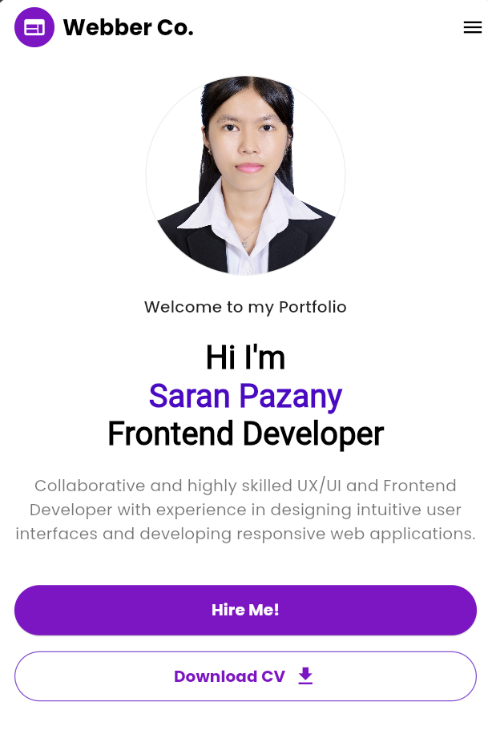

# Personal Portfolio App

## Overview

This is my personal portfolio webpage, as a Frontend Developer with expertise in UX/UI design and responsive web development. The page introduces me in a professional and engaging manner, highlighting my skills and inviting potential employers or clients to connect.

## Decription

The portfolio features a clean and modern design with a white background and purple accents. At the top, the Webber Co. logo is displayed, followed by a professional headshot. Below the image, a welcoming message introduces me as a Frontend Developer with strong UX/UI design skills. A brief description emphasizes my ability to create intuitive user interfaces and responsive web applications.

  - **Hire Me**:  Encouraging potential employers or clients to reach out.
  - **Download CV**: Allowing visitors to download her resume for more details about her experience and qualifications.

## Screenshot: 
