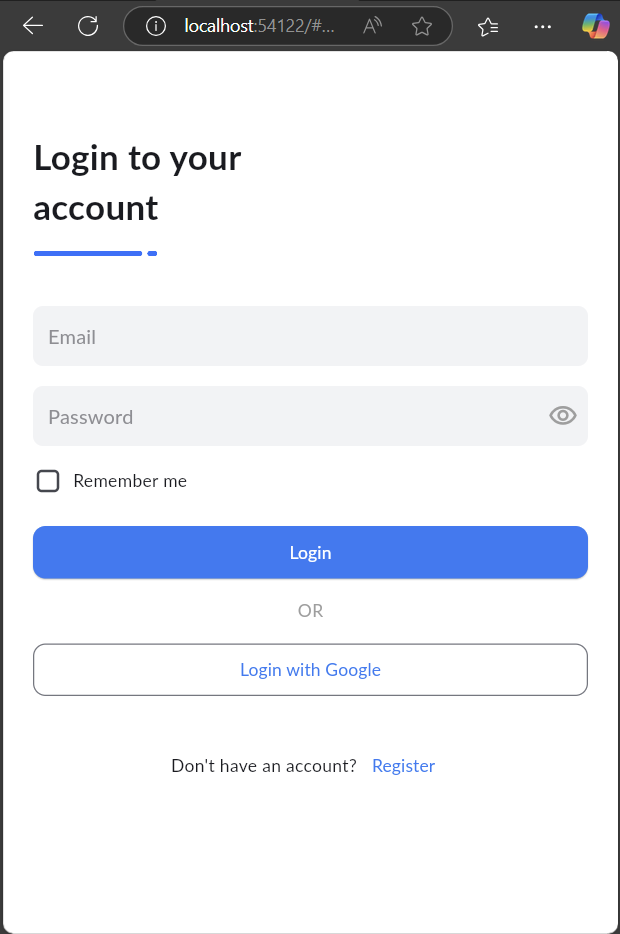
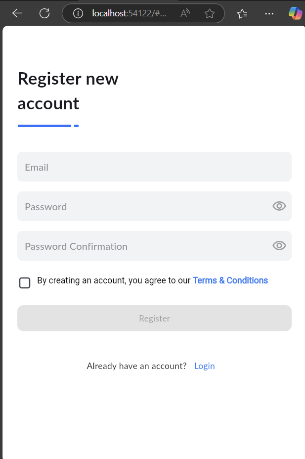
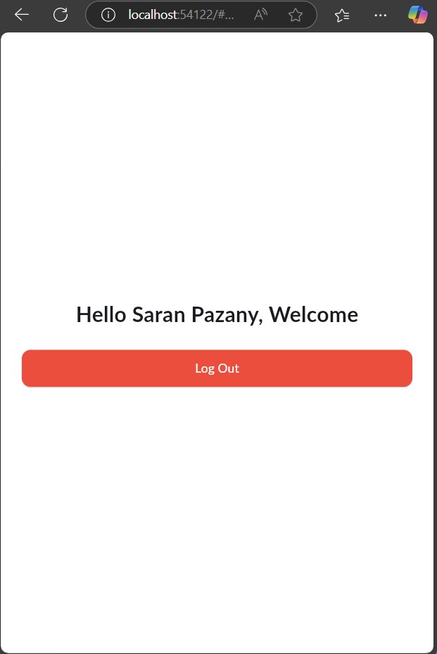

# Login Screen UI Development

## Overview

This is a simple and user-friendly authentication system, designed for a seamless login and registration experience. It allows users to create an account, log in securely, and access a personalized welcome page. The interface is clean and modern, ensuring an intuitive user experience.

## Decription

The authentication system consists of three primary pages:

### Login Page

- A minimalistic design with a white background and blue accents.

- Users can enter their email and password to sign in.

- A "Remember me" checkbox allows users to stay signed in.

- Login options include standard email/password authentication and Google sign-in.

- A "Register" link at the bottom directs new users to the registration page.

### Registration Page

- Similar in design to the login page, maintaining consistency.

- Users can enter an email, password, and confirm their password.

- A checkbox ensures users agree to the Terms & Conditions before registering.

- The "Register" button is initially disabled until all fields are properly filled.

- A "Login" link redirects existing users back to the sign-in page.

### Welcome Page

- Upon successful login, users are greeted with a personalized message.

- A large red "Log Out" button provides an easy way to end the session.

- The page maintains simplicity with a white background and a centered layout.

## Screenshot: 

